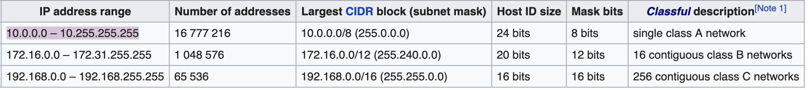

# IP

TCP/IP

Internet Protocol

v4 - 8 bit octs - so their range is 0 - 2^8(255)
v6 - 128 bits

## IP Address

IPv4 address contains octets(8 bits) , that is their range is from 0 - 2^8(255).

42 in Binary- 00101010

There are 4 octets in an IPv4 address-

127.0.0.1 - reserved by IANA to identify the computer you are using.(Localhost)

IPv4 parts -

Class	Theoretical Address Range	Binary Start	Used for-

| Class         | Theoretical Address Range     |   Size of the network bit field  | Used For             |
| ------------- |:----------------------------- |:---------------------------------|:--------------------:|
|   A           | 0.0.0.0 to 127.255.255.255    |  0              | Very Large Networks  |
|   B           |128.0.0.0 to 191.255.255.255  |	10	             | Medium networks      | 
|   C           |192.0.0.0 to 223.255.255.255	  | 110             | Small networks       |
|   D           |224.0.0.0 to 239.255.255.255   | 1110            | Multicast            |
|   E           |240.0.0.0 to 247.255.255.255   | 1111            | Experimental         |

| Class               | Leading bits | Size of network number bit field | Size of rest bit field(Subnet) | Number of networks | Addresses per network | Total addresses in class | Start address | End address     |
|---------------------|--------------|----------------------------------|------------------------|--------------------|-----------------------|--------------------------|---------------|-----------------|
| Class A             | 0            | 8                                | 24                     | 128 (2^7)           | 16777216 (2^24)        | 2147483648 (2^31)         | 0.0.0.0       | 127.255.255.255 |
| Class B             | 10           | 16                               | 16                     | 16384 (2^14)        | 65536 (2^16)           | 1073741824 (2^30)         | 128.0.0.0     | 191.255.255.255 |
| Class C             | 110          | 24                               | 8                      | 2097152 (2^21)      | 256 (2^8)              | 536870912 (2^29)          | 192.0.0.0     | 223.255.255.255 |
| Class D (multicast) | 1110         | not defined                      | not defined            | not defined        | not defined           | 268435456 (2^28)          | 224.0.0.0     | 239.255.255.255 |
| Class E (reserved)  | 1111         | not defined                      | not defined            | not defined        | not defined           | 268435456 (2^28)          | 240.0.0.0     | 255.255.255.255 |

### Class A - The first bit of the first octet is always set to 0 (zero).
Binary start = 0
Remaining bits in 1 st octet = 7
That is range = 2^7 = 128 
So First IP octet could range from 0-127 in class A.

### Class B
Binary starts = 10
remaining bits in the first octet = 6
so remaining values allowed = 2^6 = 64
So First IP octet could range from 128 - 191 in class B. (128+64 = 192)

### Class C
Binary Start 110
Remaining bits - 5
So remaining values allowed = 2^5 = 32
So First IP octet could range from 192 -223 in class B. (192+32 = 224)

### Class D
Binary Start 1110
remaining bits - 4
So remaining values allowed = 2^4 = 16
So First IP octet could range from 224 -239 in class B. (224+16 = 240)

### Class E
Binary Start 1111
remaining bits - 3
So remaining values allowed = 2^3 = 8
So First IP octet could range from 240 -247 in class B. (240+16 = 248)

Class C networks use a default subnet mask of 255.255.255.0 and have 192-223 as their first octet. 
Address 192.168.123.132 is a class C address. Its first octet is 192, which is between 192 and 223, inclusive.

 
  
 ## Subnet Mask -
  The subnet mask is used by the TCP/IP protocol to determine whether a host is on the local subnet or on a remote network.
Consider IP 192.168.123.132 
In binary 11000000.10101000.01111011.10000100 

Now, If the subnet mask is 255.255.255.0. 
That is in Binary - 11111111.11111111.11111111.00000000 

Then the address is divided as follows
 192.168.123.0 - network address
 0.0.0.132 - host address.

### Based on the class of address, different subnet masks are used.
- Class A has 24 bit subnet mask(255.0.0.0). That is first octet reserved for Network
- Class B has 16 bit subnet mask(255.255.0.0). That is first two octets reserved for network.
- Class C has 8 bit subnet mask(255.255.255.0), that is first three octets reserved for network.

So in the above example case, the first 24 bits (the number of ones in the subnet mask) are used to identify as the network address, with the last 8 bits identifying the host address(the number of remaining zeros in the subnet mask)

When a packet arrives on the 192.168.123.0 network (from the local subnet or a remote network), 
and it has a destination address of 192.168.123.132, your computer will receive it from the network and process it.

### CIDR notation
Classless Inter Domain Routing Notation.
IP addresses contain 4 octets, each consisting of 8 bits giving values between 0 and 255.
The decimal value that comes after the slash is the number of bits consisting of the routing prefix. 

__192.168.123.132/16__
IP - 192.168.123.132
Routing prefix - 16

Routing prefix 16 means that there are 16 bits available in the subnet mask to represent address.
Which means the subnet mask is 255.255.0.0
Which mean that we can represent 2^16 address using this subnet mask.

First IP that can be represented - 192.168.0.1 
Last IP that can be represented - 192.168.255.254  

16 bits for prefix means = out of 4 octets of 8 bit each =  first 16 bits are fixed for network address, remaining 16 for subnet mask. So you start at the range from 0.1 and go to max 255.254.

## DHCP
Dynamic Host Configuration protocol. 
A DHCP server is used for Dynamic Addressing, that is automatic assignment of IP addresses.

The basic function of the DHCP service is to automatically assign IP addresses to client systems. To do this, ranges of IP addresses, known as scopes, are defined on a system running a DHCP server application. When another system configured as a DHCP client is initialized, it asks the server for an address. If all things are as they should be, the server assigns an address to the client for a predetermined amount of time, which is known as the lease, from the scope.

A DHCP server typically can be configured to assign more than just IP addresses. It often is used to assign the subnet mask, the default gateway, and Domain Name Service (DNS) information.

## Private Networks

